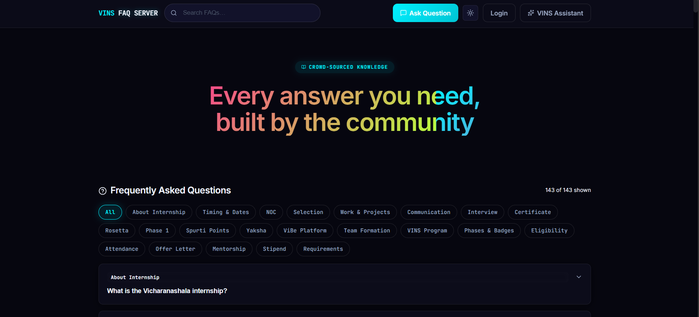
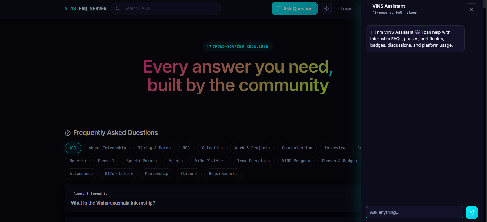
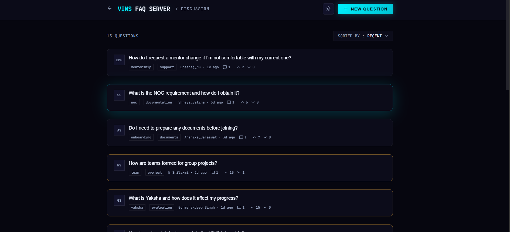
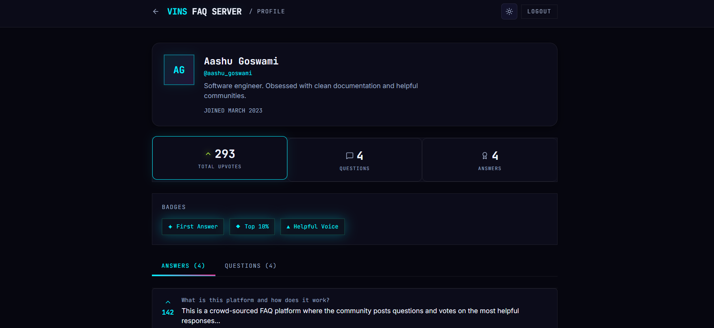
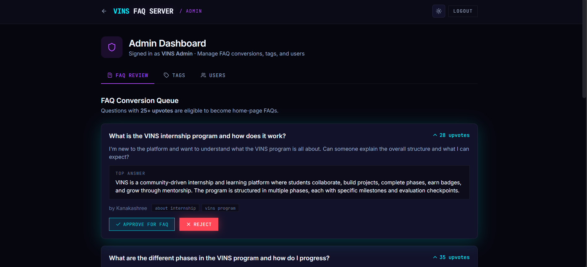

# Crowd-Sourced FAQ Platform

## 📌 Overview

Crowd-Sourced FAQ is a full-stack community-driven FAQ platform designed to help users ask questions, share answers, and build a knowledge base collaboratively. The platform combines traditional discussion forum features with AI-powered semantic search and chatbot assistance to improve information discovery and user engagement.

The application provides role-based access for regular users and administrators, enabling community participation alongside structured content moderation. It also features a modern neon-themed UI with full dark/light mode support and smooth interactive animations.

---

## ✨ Key Features

### User Features

- Browse frequently asked questions
- Search FAQs using semantic/NLP-based search
- Filter FAQs by tags
- Ask new questions and participate in discussions
- Post answers to community questions
- Upvote/downvote questions and answers
- View personal activity and earned badges
- Personalized profile with statistics

### Admin Features

- Review highly-upvoted questions for FAQ conversion
- Approve community discussions into official FAQs
- Manage tags (create/edit/delete)
- Manage users and roles
- Promote users to admin
- Moderate platform content

### AI-Powered Features

- VINS Assistant chatbot
- Semantic search for intelligent FAQ matching
- Context-aware responses for internship-related queries
- Smart fallback suggestions for unanswered questions

### UI/UX Features

- Fully responsive design
- Dark/Light mode with persistence
- Neon-themed modern interface
- Smooth transitions and animations
- Interactive voting effects

---

## 🛠️ Technology Stack

### Frontend

- React 18
- React Router DOM
- Vite
- CSS3
- React Hooks
- Lucide React Icons

### Authentication & Security

- JWT Authentication
- Role-Based Access Control
- Protected Routes

### State & Data Management

- Local State Management using React Hooks
- Mock Data Architecture (API-ready)

### Core Concepts

- SPA Architecture
- Semantic Search
- Conditional Rendering
- Lazy Loading
- Responsive Design

---

## 📂 Core Modules

### 🏠 Home Page

- Landing page of the platform
- FAQ listing with accordion cards
- Search and tag filtering
- AI chatbot access
- Protected navigation to discussion system

### 💬 Discussion Page

Community-driven discussion board where users:

- Ask questions
- Post answers
- Vote on helpful content
- Sort discussions by popularity or recency

### 👤 Profile Page

Displays:

- User information
- Badges
- Activity history
- Statistics (questions, answers, upvotes)

### 🛡️ Admin Dashboard

Admin-only management panel containing:

- FAQ Review
- Tags Management
- Users Management

### 🤖 VINS Assistant

AI-powered chatbot for:

- Answering FAQ queries
- Semantic search assistance
- Internship-specific guidance

---

## 🧠 Key Functionalities

- NLP-based semantic search
- Dynamic FAQ filtering
- Real-time vote updates
- Role-based routing
- Session persistence with JWT
- Community moderation workflow
- Badge and reward system

---

## 📸 Preview

### Home Page



### Chat bot



### Discussion Page



### Profile Page



### Admin Dashboard



---

## ⚙️ Installation & Setup

1. Clone the repository:

```bash
git clone https://github.com/Aashu-Goswami/Crowd-Source-FAQ-Frontend.git
```

2. Navigate to the project folder:

```bash
cd Crowd-Sourced-FAQ-Frontend
```

3. Install dependencies:

```bash
npm install
```

4. Run development server:

```bash
npm run dev
```

---

## 🧠 Concepts Practiced

- Full Stack Application Design
- Authentication & Authorization
- Role-Based Access Control
- React Component Architecture
- State Management
- UI/UX Engineering
- Semantic Search Systems
- Admin Dashboard Design

---

## 🚀 Future Improvements

- WebSocket-based live updates
- Notifications system
- File uploads
- Analytics dashboard
- Advanced search engine integration

---

## 🎯 Learning Outcomes

This project helped strengthen our understanding of full-stack application architecture, frontend engineering with React, authentication workflows, scalable UI design, and building community-focused software systems.

---

## 👤 Author

Aashu Goswami
Kanakashree
